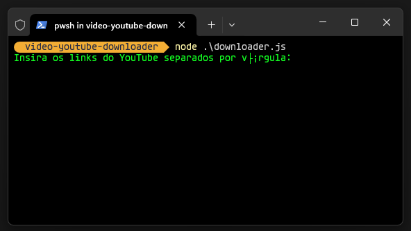

# YouTube Video Downloader (Node.js)


Este é um script Node.js que permite baixar vídeos do YouTube na melhor qualidade disponível. 
O usuário pode inserir múltiplos links de vídeos e o script fará o download automaticamente, 
salvando-os com o título original.

## 📌 Recursos
- Permite inserir múltiplos links do YouTube separados por vírgula.
- Baixa os vídeos na melhor qualidade disponível (vídeo + áudio combinados).
- Salva os arquivos com o título original do vídeo.
- Utiliza `yt-dlp` para o download.

## 🚀 Instalação e Uso

### 1️⃣ Pré-requisitos
Antes de rodar o script, certifique-se de ter o **Node.js** e o **yt-dlp** instalados no seu sistema.

### 🔹 Instalar o `yt-dlp`
**Windows**:  
Baixe `yt-dlp.exe` em [este link](https://github.com/yt-dlp/yt-dlp/releases/latest) e mova para `C:\Windows\System32` ou para a pasta do projeto.  
  
**Linux/macOS**:  
```sh
sudo apt install yt-dlp  # Ou
pip install yt-dlp
```

Teste se está instalado corretamente:
```sh
yt-dlp --version
```

### 2️⃣ Instalar dependências do Node.js
```sh
npm init -y
npm install readline-sync child_process
```

### 3️⃣ Executar o script
```sh
node downloader.js
```

### 4️⃣ Inserir os links dos vídeos
Digite ou cole os links separados por vírgula:
```
https://www.youtube.com/watch?v=abc123, https://www.youtube.com/watch?v=xyz456
```

Os vídeos serão baixados automaticamente na pasta `downloads/`.

## 📂 Estrutura do Projeto
```
/video-youtube-downloader
│── downloader.js
│── package.json
│── downloads/   (Pasta onde os vídeos serão salvos)
└── yt-dlp.exe   (Opcional, se não instalado no sistema)
```

## 🛠 Tecnologias Utilizadas
- Node.js
- yt-dlp

## 📜 Licença
Este projeto está sob a licença MIT.
